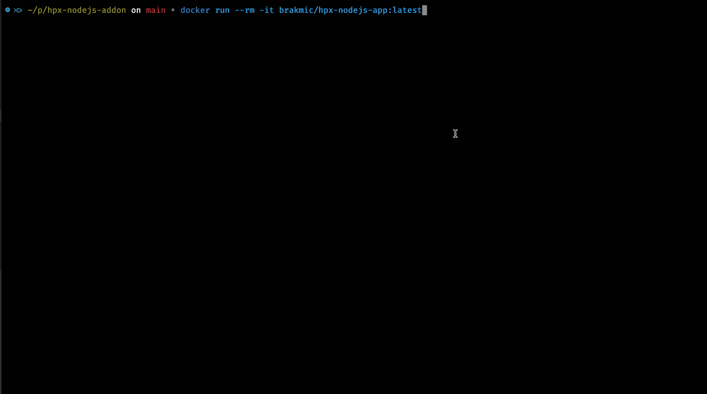
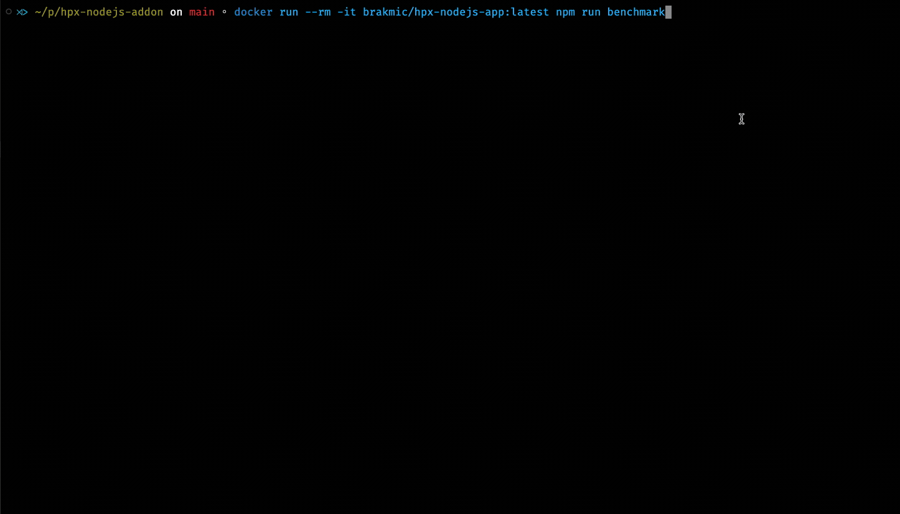
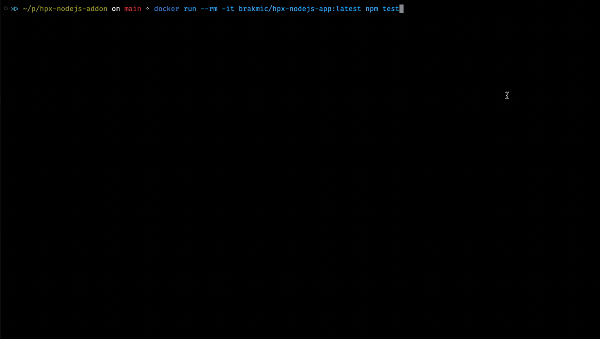

# HPX Node.js Addon

**Table of Contents**  
- [HPX Node.js Addon](#hpx-nodejs-addon)
  - [Introduction](#introduction)
  - [Features \& Capabilities](#features--capabilities)
  - [Architecture Overview](#architecture-overview)
    - [Node-API Integration](#node-api-integration)
    - [Asynchronous Execution with HPX](#asynchronous-execution-with-hpx)
    - [ThreadSafeFunctions and JavaScript Callbacks](#threadsafefunctions-and-javascript-callbacks)
    - [Data Conversion and Memory Management](#data-conversion-and-memory-management)
    - [Logging and Debugging](#logging-and-debugging)
  - [Installation \& Setup](#installation--setup)
    - [Building Locally](#building-locally)
    - [Building with Docker (Recommended)](#building-with-docker-recommended)
  - [Using the Addon](#using-the-addon)
    - [Running Locally](#running-locally)
    - [Using Docker](#using-docker)
  - [Configuration Options](#configuration-options)
  - [Usage Examples (Quick Start)](#usage-examples-quick-start)
  - [Debugging](#debugging)
    - [Editing Files with Nano](#editing-files-with-nano)
    - [Debugging with GDB](#debugging-with-gdb)
  - [Troubleshooting](#troubleshooting)
  - [License](#license)

---

## Introduction

The **HPX Node.js Addon** seamlessly integrates the [HPX C++ runtime system](https://hpx-docs.stellar-group.org/latest/html/index.html) into Node.js, enabling high-performance parallel computations directly from JavaScript code. By leveraging HPX's advanced parallel algorithms and execution policies, this addon allows developers to perform CPU-intensive operations efficiently without blocking the Node.js event loop.

**Key Benefits:**
- **Seamless Parallelization:** Offload heavy computations to HPX threads while maintaining a responsive Node.js application.
- **Advanced Execution Policies:** Utilize HPX's parallel, sequential, and unsequenced execution policies to optimize performance based on your specific use case.
- **Customizable Predicates & Comparators:** Define and use custom JavaScript functions for complex data processing tasks.
- **Batch Processing:** Enhance performance by minimizing cross-boundary calls between C++ and JavaScript through batch processing strategies.

For a comprehensive understanding of the addon's architecture and advanced usage scenarios, refer to the [Architecture](./docs/Architecture.md) and [Advanced Topics](./docs/AdvancedTopics.md) documents. For additional examples and practical demonstrations, explore the [Examples](./docs/Examples.md) section.

---

## Features & Capabilities

- **Seamless Parallelization of C++ Algorithms in Node.js:**  
  Offload heavy computations to HPX and retrieve results as typed arrays, ensuring non-blocking operations in your Node.js applications.

- **Configurable Execution Policies:**  
  Choose between sequential (`seq`), parallel (`par`), or parallel unsequenced (`par_unseq`) execution policies. Control the transition from parallel to sequential execution based on a user-defined threshold.

- **Custom Predicates and Comparators:**  
  Define custom JavaScript predicate or comparator functions. The addon employs [ThreadSafeFunctions (TSFNs)](https://github.com/nodejs/node-addon-api/blob/main/doc/threadsafe.md) to safely invoke these functions from C++ threads without hindering the Node.js event loop.

- **Batch Processing of JavaScript Callbacks:**  
  For operations like `countIf`, `copyIf`, `sortComp`, and `partialSortComp`, the addon utilizes batch processing to minimize overhead. This involves converting per-element predicates/comparators into batch versions using provided helper functions (`elementPredicateToMask`, `elementComparatorToKeys`), allowing the addon to handle large datasets efficiently.

- **Flexible Configuration:**  
  Adjust parameters such as `threadCount`, `threshold`, `logLevel`, and more through a JSON configuration object to tailor the addon's performance to your system and application needs.

- **Robust Error Handling:**  
  Receive meaningful error messages and ensure that exceptions within asynchronous operations are properly propagated to JavaScript, facilitating easier debugging and more resilient applications.

- **Scalability:**  
  Designed to handle large arrays efficiently, the addon scales well with data size and system resources, making it suitable for demanding real-time data processing applications.

- **Debugging Tools:**  
  Leverage built-in logging and integrate with debugging tools like `nano` and `gdb` within Docker containers to troubleshoot both JavaScript and native C++ components effectively.

---

## Architecture Overview

The **HPX Node.js Addon** operates through a well-defined architecture that ensures efficient integration between JavaScript and HPX's C++ runtime. Here's an in-depth look at its core components:

### Node-API Integration

- **Node-API (N-API):**  
  The addon is built using [Node-API](https://nodejs.org/api/n-api.html), providing a stable and ABI-compatible interface for building native addons in C++. This ensures that the addon remains compatible across different Node.js versions without requiring recompilation.

- **Function Registration:**  
  Functions like `sort`, `count`, `copyIf`, `sortComp`, etc., are registered as JavaScript-callable functions. Each function returns a `Promise`, enabling asynchronous execution and seamless integration with JavaScript's async/await patterns.

### Asynchronous Execution with HPX

- **HPX Runtime Initialization:**  
  The addon initializes the HPX runtime in a background thread using the `initHPX` function. This ensures that HPX's parallel execution capabilities are available without blocking the main Node.js thread.

- **Parallel Algorithms:**  
  When a JavaScript function like `hpxaddon.sort()` is invoked, the addon schedules the corresponding HPX parallel algorithm (e.g., `hpx::sort`) to run asynchronously. These operations are executed across multiple HPX threads, leveraging multi-core architectures for enhanced performance.

- **Promise-Based API:**  
  Each asynchronous operation returns a `Promise` that resolves with the result once the HPX task completes. This design keeps the Node.js event loop responsive, even during intensive computations.

### ThreadSafeFunctions and JavaScript Callbacks

- **ThreadSafeFunctions (TSFNs):**  
  For operations requiring custom JavaScript predicates or comparators (e.g., `countIf`, `copyIf`, `sortComp`), the addon uses TSFNs to safely call back into JavaScript from C++ threads. This mechanism ensures thread safety and prevents potential data races or corruption.

- **Batch Processing Strategy:**  
  To minimize the overhead of multiple TSFN calls, the addon employs a batch processing approach:
  1. **Batch Conversion:** Convert per-element JavaScript predicates/comparators into batch-processing functions using helper functions (`elementPredicateToMask`, `elementComparatorToKeys`).
  2. **Single Invocation:** The batch function is called once with the entire data array, returning a mask (`Uint8Array`) or keys (`Int32Array`).
  3. **Efficient Processing:** The addon uses the returned mask or keys in C++ to perform the desired operation without invoking JavaScript functions for each element.

### Data Conversion and Memory Management

- **Typed Arrays:**  
  The addon primarily works with `Int32Array` for input and output, mapping them to `std::vector<int32_t>` in C++. This direct mapping avoids unnecessary data copying, ensuring efficient memory usage.

- **Memory Handling:**  
  - **Input Data:**  
    When a JavaScript `Int32Array` is passed to the addon, it is mapped to a C++ vector for processing.
  
  - **Output Data:**  
    Results are returned as new `Int32Array` instances, created from C++ vectors after processing. This ensures that data flows seamlessly between JavaScript and C++ without manual intervention.

- **Shared Pointers:**  
  The addon uses `std::shared_ptr<std::vector<int32_t>>` to manage data lifetimes, especially when dealing with asynchronous HPX tasks. This ensures that data remains valid throughout the operation's lifecycle.

### Logging and Debugging

- **Custom Logger:**  
  The addon includes a custom logging system controlled by configuration options (`loggingEnabled`, `logLevel`). Logs provide insights into the HPX runtime lifecycle, async operations, and TSFN callbacks.

- **Debugging Tools:**  
  Within Docker containers, developers can use tools like `nano` for editing JavaScript files and `gdb` for debugging native C++ code. Detailed logging combined with these tools facilitates effective troubleshooting.

For a deeper dive into each architectural component, refer to the [Architecture](./docs/Architecture.md) document.

---

## Installation & Setup

Building and setting up the **HPX Node.js Addon** can be accomplished either locally or using Docker. Both methods are supported, but building with Docker is **recommended** for consistency and ease of setup.

### Building Locally

**Prerequisites:**

- **Node.js v20 or Newer:**  
  Ensure that you have Node.js version 20 or later installed on your system.

- **HPX Installed:**  
  HPX should be installed in `/usr/local/hpx`. You can follow the [HPX Installation Guide](https://hpx-docs.stellar-group.org/latest/html/index.html#installation) for manual installation.

- **C++17 Toolchain:**  
  A working C++17 compiler and related build tools are required to compile the addon.

**Steps:**

1. **Clone the Repository:**

   ```bash
   git clone https://github.com/brakmic/hpx-nodejs-addon.git
   cd hpx-nodejs-addon
   ```

2. **Navigate to the Addon Directory:**

   The addon source code is located in the `addon` folder.

   ```bash
   cd addon
   ```

3. **Install Dependencies and Build the Addon:**

   ```bash
   npm install
   ```

   This command executes `node-gyp rebuild`, compiling the C++ addon. Ensure that all prerequisites are met to avoid build failures.

4. **Initialize HPX in Your Application:**

   Before using any addon functions, initialize HPX as shown in the [Usage Examples](#usage-examples-quick-start) section.

**Note:** For detailed instructions, refer to the [Bulding](./docs/Building.md) guide.

### Building with Docker (Recommended)

Using Docker simplifies the setup process by encapsulating all dependencies and build steps within Docker images. This ensures a consistent and reproducible environment across different development machines.

**Prerequisites:**

- **Docker Installed:**  
  Ensure that Docker is installed and running on your system. You can download Docker from [here](https://www.docker.com/get-started).

**Steps:**

1. **Clone the Repository:**

   ```bash
   git clone https://github.com/brakmic/hpx-nodejs-addon.git
   cd hpx-nodejs-addon
   ```

2. **Build the Addon Docker Image:**

   ```bash
   docker build -t brakmic/hpx-nodejs-addon-builder:v0.1 -f addon.Dockerfile .
   ```

   This command builds the addon using the `addon.Dockerfile`, resulting in a Docker image tagged as `brakmic/hpx-nodejs-addon-builder:v0.1` that contains the compiled `hpxaddon.node` binary.

3. **Build the Application Docker Image:**

   ```bash
   docker build -t brakmic/hpx-nodejs-app:latest -f app.Dockerfile .
   ```

   This builds the application image tagged as `brakmic/hpx-nodejs-app:latest`, which includes scripts for running the application (`index.mjs`), benchmarking (`benchmark.mjs`), and tests.

---

## Using the Addon

After building the addon, whether locally or using Docker, you can utilize it in your applications. Below are instructions for both methods.

### Running Locally

1. **Navigate to the Addon Directory:**

   Ensure you're in the `addon` directory where the addon was built.

   ```bash
   cd addon
   ```

2. **Create or Modify JavaScript Scripts:**

   Use your preferred editor to create or edit JavaScript files that utilize the addon. For example:

   - **Edit `index.mjs`:**

     ```bash
     nano index.mjs
     ```

     Add your application logic using the addon functions.

   - **Edit `benchmark.mjs`:**

     ```bash
     nano benchmark.mjs
     ```

     Add benchmarking scripts to compare addon performance with native JavaScript implementations.

3. **Run the Application:**

   ```bash
   node index.mjs
   ```
   

   Or run benchmarks:

   ```bash
   npm run benchmark
   ```
   

4. **Run Tests:**

   ```bash
   npm test
   ```

   

### Using Docker

Using Docker abstracts away the complexities of managing dependencies and environments. Here's how to run your application within Docker.

1. **Run the JavaScript Application (`index.mjs`):**

   ```bash
   docker run --rm brakmic/hpx-nodejs-app:latest
   ```

   This command starts the `hpx-nodejs-app` container, runs `index.mjs` using the compiled addon, and outputs the results.

2. **Run the Benchmark (`benchmark.mjs`):**

   ```bash
   docker run --rm brakmic/hpx-nodejs-app:latest npm run benchmark
   ```

   This executes the benchmarking script inside the Docker container, comparing HPX-based operations with native JavaScript implementations.

3. **Run Tests:**

   ```bash
   docker run --rm brakmic/hpx-nodejs-app:latest npm test
   ```

   Or directly run a specific test script:

   ```bash
   docker run --rm brakmic/hpx-nodejs-app:latest node test/hpx-addon.test.mjs
   ```

4. **Access the Container's Shell for Debugging:**

   If you need to modify scripts or debug within the container:

   ```bash
   docker run -it brakmic/hpx-nodejs-app:latest /bin/bash
   ```

   Inside the container, you can use `nano` to edit files or `gdb` to debug native addon issues.

---

## Configuration Options

You can configure the HPX runtime by passing a configuration object to `initHPX`. Here's the available configuration options:

```js
await hpxaddon.initHPX({
  executionPolicy: 'par',       // Execution policy: "seq", "par", "par_unseq"
  threshold: 10000,              // Threshold for task granularity (smaller arrays run sequentially)
  threadCount: 4,                // Number of HPX threads to spawn
  loggingEnabled: true,          // Enable or disable logging
  logLevel: 'info',              // Logging level: "debug", "info", "warn", "error"
  addonName: 'hpxaddon'          // Name of the addon (optional)
});
```

**Configuration Details:**

- **executionPolicy:**  
  Determines how algorithms are executed.  
  - `"seq"`: Sequential execution.  
  - `"par"`: Parallel execution.  
  - `"par_unseq"`: Parallel unsequenced execution.

- **threshold:**  
  Sets the threshold for task granularity. Arrays smaller than this value will execute sequentially to avoid parallel overhead.

- **threadCount:**  
  Specifies the number of HPX threads to spawn, typically aligned with the number of CPU cores for optimal performance.

- **loggingEnabled & logLevel:**  
  Control logging behavior. Enable logging and set the desired verbosity level to monitor internal operations and debug issues.

For a comprehensive list and explanation of configuration options, see [Configuration](./docs/Configuration.md).

---

## Usage Examples (Quick Start)

Here's a quick example to get you started with the HPX Node.js Addon:

```js
import { createRequire } from 'module';
const require = createRequire(import.meta.url);
const hpxaddon = require('./addons/hpxaddon.node');

(async () => {
  // Initialize HPX
  await hpxaddon.initHPX({
    executionPolicy: 'par',
    threshold: 10000,
    threadCount: 4,
    loggingEnabled: true,
    logLevel: 'debug'
  });

  // Sorting an Int32Array
  const arr = Int32Array.from([5, 3, 8, 1, 9]);
  const sorted = await hpxaddon.sort(arr);
  console.log('Sorted Array:', sorted); // Int32Array [1, 3, 5, 8, 9]

  // Counting occurrences of a value
  const data = Int32Array.from([1, 2, 2, 3, 2, 4, 2]);
  const countOf2 = await hpxaddon.count(data, 2);
  console.log(`Count of 2: ${countOf2}`); // Output: Count of 2: 4

  // Finalize HPX before exiting
  await hpxaddon.finalizeHPX();
})();
```

**Note:** Ensure that you call `finalizeHPX()` to gracefully shut down the HPX runtime when your application is terminating.

---

## Debugging

Effective debugging ensures that your application runs smoothly and efficiently. The **HPX Node.js Addon** provides tools and strategies to debug both JavaScript and native C++ components.

### Editing Files with Nano

To modify JavaScript files within the Docker container:

1. **Access the Container's Shell:**

   Launch a bash shell inside the `brakmic/hpx-nodejs-app` container:

   ```bash
   docker run -it brakmic/hpx-nodejs-app:latest /bin/bash
   ```

2. **Edit JavaScript Files Using Nano:**

   - **Edit `index.mjs`:**

     ```bash
     nano index.mjs
     ```

   - **Edit `benchmark.mjs`:**

     ```bash
     nano benchmark.mjs
     ```

   After making changes, save your edits by pressing `Ctrl + O`, then exit `nano` with `Ctrl + X`.

### Debugging with GDB

When encountering crashes or unexpected behavior in the native addon, **GNU Debugger (GDB)** can be invaluable for diagnosing issues.

1. **Access the Container's Shell:**

   ```bash
   docker run -it brakmic/hpx-nodejs-app:latest /bin/bash
   ```

2. **Start GDB with the Desired Script:**

   - **Debug `index.mjs`:**

     ```bash
     gdb --args node index.mjs
     ```

   - **Debug `benchmark.mjs`:**

     ```bash
     gdb --args node benchmark.mjs
     ```

3. **Run the Script Within GDB:**

   Inside the GDB prompt, start execution by typing:

   ```gdb
   run
   ```

4. **Handling Crashes:**

   If the application crashes, GDB will catch the signal. To obtain a detailed backtrace, enter:

   ```gdb
   bt full
   ```

   This command provides a comprehensive stack trace, helping you identify where the crash occurred.

5. **Additional GDB Commands:**

   - **Set Breakpoints:**

     ```gdb
     break main
     ```

   - **Step Through Code:**

     ```gdb
     step
     ```

   - **Continue Execution:**

     ```gdb
     continue
     ```

   - **Inspect Variables:**

     ```gdb
     print variableName
     ```

   For more advanced debugging techniques, refer to the [GDB Documentation](https://www.gnu.org/software/gdb/documentation/).

**Note:** Debugging native addons with GDB is most effective when the addon is built with debugging symbols. Ensure that your build configuration includes debug information to facilitate meaningful debugging sessions.

---

## Troubleshooting

Encountering issues is a natural part of development. Here's how to address common problems with the **HPX Node.js Addon**:

- **Check Logs for Detailed Information:**
  - Enable `loggingEnabled` and set `logLevel` to `debug` to view detailed internal operations.

- **HPX Fails to Start:**
  - Ensure HPX is correctly installed and that the `LD_LIBRARY_PATH` is properly set.
  - Verify that all dependencies are installed and that there are no version mismatches.

- **Missing Libraries at Runtime:**
  - Confirm that `COPY --from=...` steps in the `app/Dockerfile` are correct.
  - Ensure that `LD_LIBRARY_PATH` includes the directories where HPX and other dependencies are installed.

- **Performance Overhead:**
  - Running inside Docker might introduce slight overhead. Allocate sufficient CPU and memory resources to the Docker daemon for accurate benchmarks.

- **Debugger Tools Not Found:**
  - If `nano` or `gdb` are not available within the container, ensure they are installed via the `app/Dockerfile`:
  
    ```dockerfile
    RUN apt-get update && apt-get install -y nano gdb
    ```
  
  - Rebuild the `app/Dockerfile` image after making this change.

- **Invalid Input Types:**
  - Ensure that all inputs to addon functions are of the expected types. For example, `sort` expects an `Int32Array`.
  - Use try-catch blocks to handle and log errors gracefully.

- **Predicate/Comparator Errors:**
  - Ensure that predicate functions return a `Uint8Array` and comparator functions return an `Int32Array` of keys.
  - Verify that batch functions are correctly implemented to avoid mismatched array lengths or types.

For unresolved issues, consider consulting the [Documentation](./docs/Troubleshooting.md) or reaching out to the community through [Issues](https://github.com/brakmic/hpx-nodejs-addon/issues).

---

**Additional Resources:**
- [Architecture](./docs/Architecture.md)
- [Benchmarking](./docs/Benchmarking.md)
- [Building](./docs/Building.md)
- [Configuration](./docs/Configuration.md)
- [Docker](./docs/Docker.md)
- [Examples](./docs/Examples.md)
- [Internals](./docs/Internals.md)
- [Predicates](./docs/Predicates.md)
- [Testing](./docs/Testing.md)

## License

This project is distributed under the MIT License. See [LICENSE](./LICENSE) for full details.
